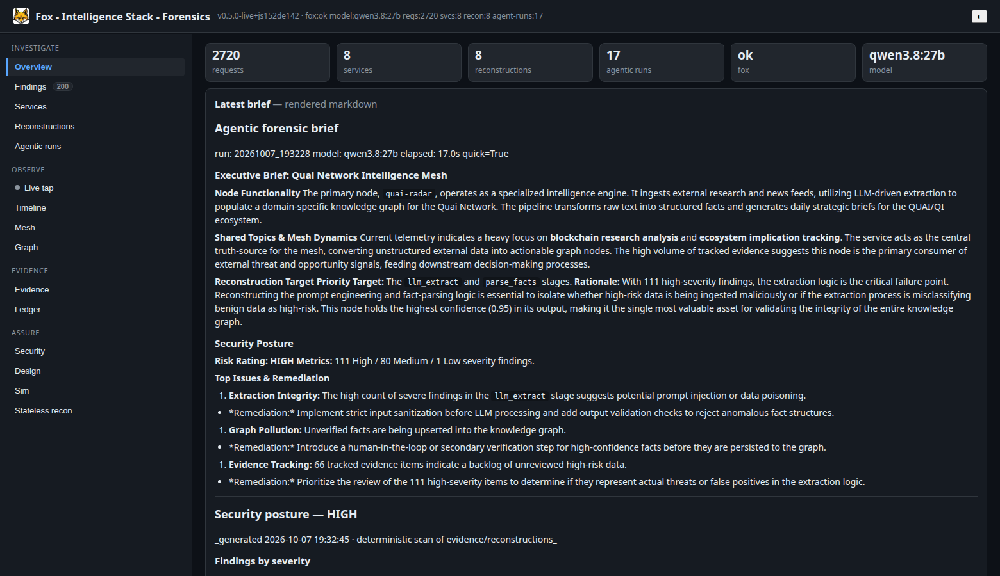
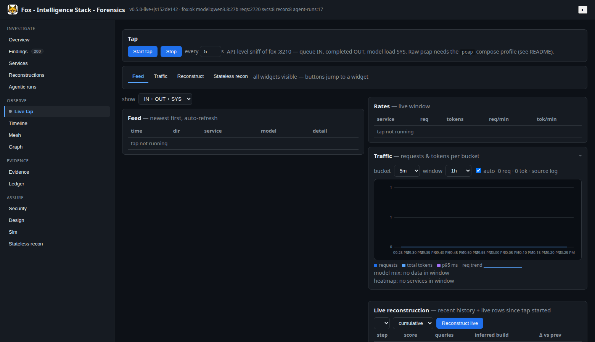
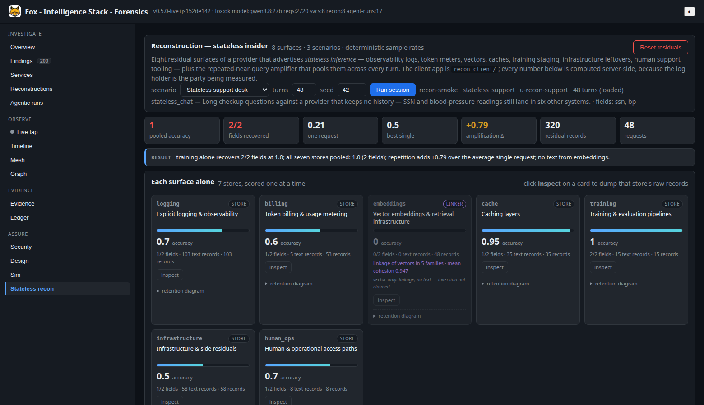
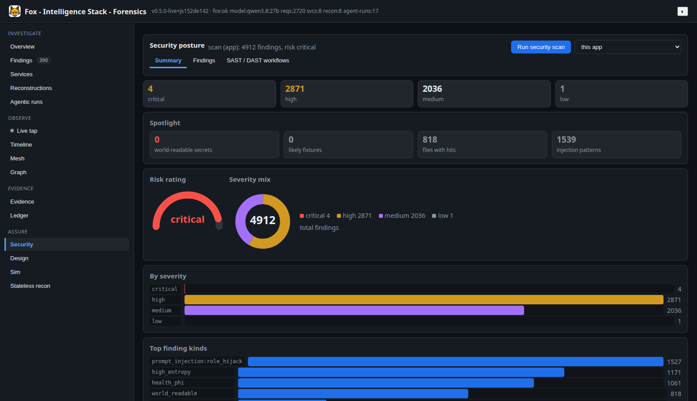
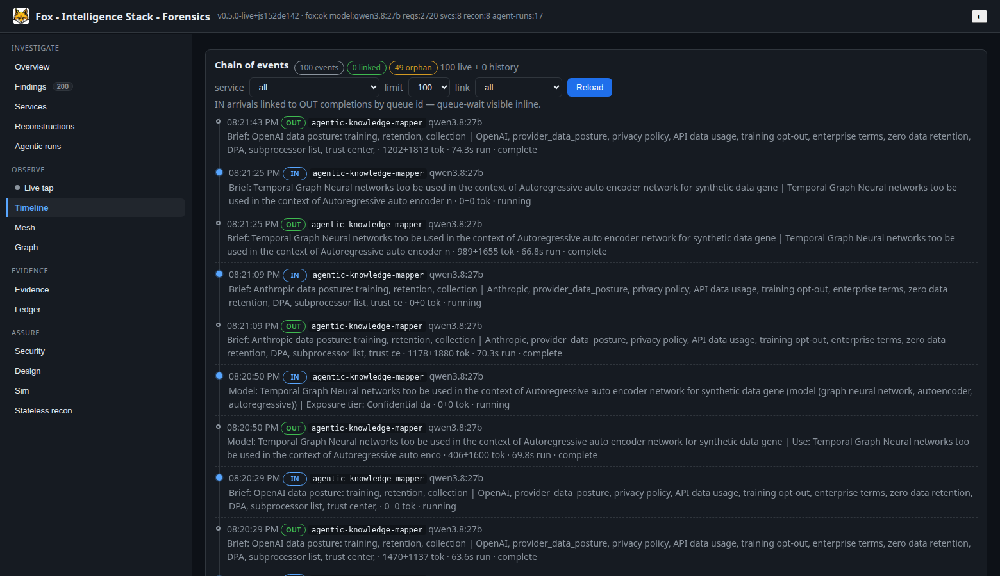
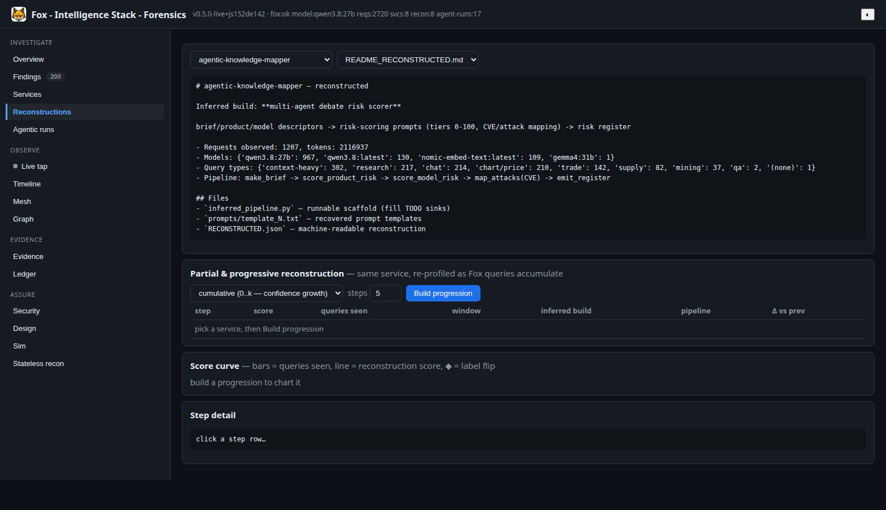
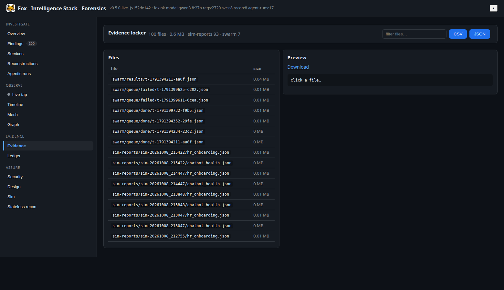
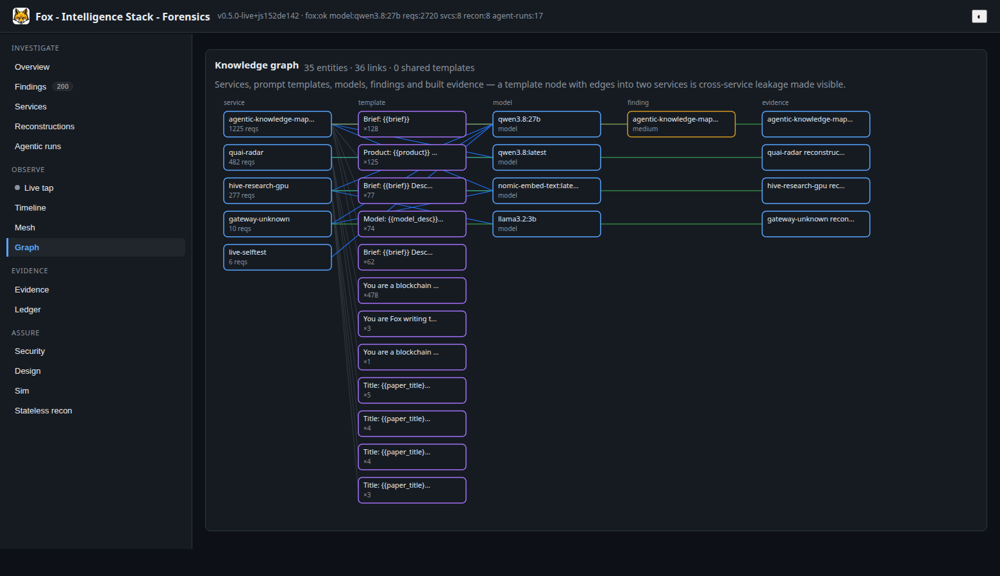
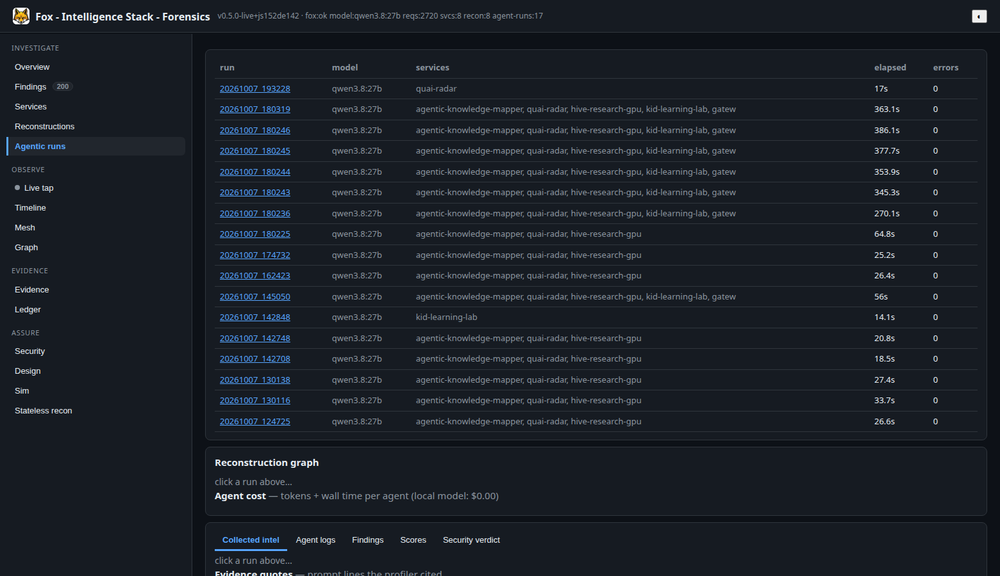

# Fox - Intelligence Stack - Forensics — investigator + builder

Reconstructs **what other nodes/services are building** purely by observing
`../fox-services` logs (LLM gateway telemetry, mesh peers, docker overview).

No access to their repos needed. The fox DB stores per-request
`service, model, prompt(head), query_type, requestor, tokens, timings` —
enough to fingerprint prompt templates, infer pipelines, and rebuild a
runnable scaffold of each observed codebase.

## Quick start

```bash
python cli.py investigate --hours 720 --limit 5000   # collect + profile + evidence/INVESTIGATION.md
python cli.py build                                    # reconstructions/<service>/ scaffolds
python cli.py build --only quai-radar
python cli.py fingerprint --service quai-radar
# LLM agentic deep-dive (local Qwen 3.8-27B via Ollama):
python cli.py agent-run --quick                        # top-3 services, ~20s
python cli.py agent-run                                # all services + critic stage, ~2-4 min
# Dashboard (FastAPI, needs repo venv for fastapi/uvicorn):
/home/fox/codebase/.venv/bin/python dashboard.py --port 8211   # open http://localhost:8211/
python cli.py dashboard --port 8211                    # same, via venv python
```

Env: `FOX_URL` (default `http://localhost:8210`), `FOX_SERVICES_DB` override,
`OLLAMA_URL` (default `http://localhost:11434`), `IF_MODEL` (default `qwen3.8:27b`),
`IF_PORT` (default `8211`).

## Visual tour

Screenshots captured live against the dashboard (`docs/screenshots/shoot.py`
with Playwright + headless Chromium — re-run it any time the UI changes).

### Overview — mesh at a glance



KPI tiles (requests, services, reconstructions, agent runs, Fox reachability,
model) above the latest agentic forensic brief, rendered as markdown. The
sidebar carries every area with live badges — findings count, tap state —
and the header shows version, Fox status, and model at all times.

### Live tap — widgets, not sub-tabs



API-level sniff of Fox `:8210`: queue IN arrivals, completed OUT rows, and
model-load SYS events stream over SSE with auto-reconnect. The Feed widget
(tall, filterable) sits beside Traffic (rates + per-bucket chart + model
mix + heatmap); below are Live reconstruction (progressive re-profiling as
queries accumulate) and the Stateless recon live view (harvest → co-serve →
consume). Jump buttons scroll to any widget with a highlight flash.

### Stateless recon — what "stateless" still keeps



A provider that keeps no chat history still leaks through eight residual
surfaces — logging heads, token meters, vectors, caches, training staging,
infrastructure leftovers, support tooling — plus the repeated-near-query
amplifier. Each surface card shows solo accuracy with an inspectable raw
store; cumulative bars can only rise; amplification (Δ +0.79 above) pools
every request. Vectors report accuracy 0 and contribute linkage only —
pure vector-to-text inversion is never claimed. All values are synthetic
(900-series SSNs, `4242…` PANs).

### Security — dial, donut, verdicts



Summary / Findings / SAST-DAST workflow panes: risk-rating dial, severity
donut, spotlight KPIs, runtime-posture probe pills (8 deterministic DAST
probes, refreshed on tab open), and per-finding tables. SAST (8 static
checks) and DAST (8 loopback probes) are triaged by the local model into
confirmed / dismissed / uncertain with adjusted severity and one-line fixes
— deterministic results ship even when Ollama is down.

### Timeline, Reconstructions, Evidence, Graph, Agents



- **Timeline** — one chronological lane: IN arrivals linked to OUT
  completions by queue id (Δ-after-IN inline), hollow dots for orphans,
  pulsing dots for in-flight, link filter without refetch.


- **Reconstructions** — every rebuilt service plus persisted `recon-*`
  residual runs, file browser included.



- **Evidence** — locker with file counts, total MB, top folders, scrollable
  list beside the preview.



- **Graph / Agents** — knowledge-graph nodes, agentic runs with per-run
  graphs and cost.





## Docker + remote access (Tailscale / LAN)

> **No auth.** The dashboard implements no authentication, so its viewer
> boundary is LAN/tailnet only — bind it to a private interface and let
> Tailscale/`ufw` be the gate. Never expose it to the public internet.

```bash
docker compose up -d --build   # dashboard at :8211 (container `intel-forensics`)
```

The port binds `0.0.0.0:8211` (same mechanism as fox-services `:8210`), so it
is reachable off-host with no extra config:

- Tailscale: `http://<ip>:8211` (this host = `axiom`)
- LAN: `http://<ip>:8211`

From any other tailnet/LAN device: `curl http://<ip>:8211/health`
should return `{"status":"ok",...}`. If it times out, host `ufw` is filtering
inbound — one fix: `sudo ufw allow 8211/tcp`. HTTPS alternative:
`sudo tailscale set --operator=$USER` once, then
`tailscale serve --bg http://127.0.0.1:8211` (tailnet-only
`https://axiom.<tailnet>.ts.net`, no firewall ports involved).

## How it works

1. **Collect** (`iforensics/fox_client.py`, `store.py`): dumps every fox API
   surface (stats, queue, mesh, docker, router) to `evidence/api_dump_*.json`
   and copies the SQLite DB (WAL-safe) to `evidence/fox_services_*.db`.
2. **Fingerprint** (`fingerprints.py`): clusters prompts per service into
   stable templates (slot-ify TITLE/CONTENT/Brief/Product/Subject/…),
   recovers instruction sentences + schema hints.
3. **Investigate** (`infer.py`): heuristic rules map template vocabulary to
   project labels + pipeline stages, with counts as evidence.
4. **Build** (`reconstruct.py`): emits `reconstructions/<service>/` with
   `inferred_pipeline.py` (runnable scaffold via fox gateway),
   `prompts/template_N.txt` (recovered templates), `RECONSTRUCTED.json`.
5. **Report** (`report.py`): `evidence/INVESTIGATION.md`.
6. **Agentic deep-dive** (`agents.py`, `ollama_client.py`): every agent is the
   local `qwen3.8:27b` (Ollama, `think:false` for speed) with a different role —
   `scout` ranks targets → `profiler` (per service, threaded) infers the build
   as JSON → `critic` lists what logs can't prove → `reporter` writes the exec
   brief. Artifacts per run: `evidence/agentic/<run_id>/{manifest,scout,
   profiler.*,critic.*,reporter,BRIEF.md}.json`.
7. **Dashboard** (`dashboard.py`): single-page UI — Overview, Services,
   Reconstructions (file browser + partial/progressive view + score chart),
   Agentic runs (graph, costs, agreement, gaps, trend), Mesh, Evidence,
   **Design** — plus one-click re-investigate and background agentic launches.

## Design & architecture tab

Like fox-services' own design tab: `design/*.md` (context, UML, interaction,
activity, data model, trust boundaries, privacy, ethics, agent swarm,
simulation, reconstruction) rendered with live
Mermaid diagrams — 11 documents, 32 diagrams. Served via fixed-index API
(`GET /api/design/docs`, `GET /api/design/docs/{id}`; traversal attempts 404).
Mermaid v10 is vendored (`static/mermaid.min.js` → `/static/`, CDN fallback)
with a dark theme, so diagrams render even on offline LAN/tailnet; Markdown
gets proper joined paragraphs, lists, tables and code blocks in styled frames.

## Simulation scenarios — what each experiment leaks

All 13 scenarios (10 embedding-reconstruction workloads + 3
stateless-residual workloads) are explained with per-scenario mermaid
diagrams, leakage profiles, and reproduction commands in
[`docs/scenarios.md`](docs/scenarios.md) — start there to read any curve
in the Sim or Stateless recon tabs.

## Live sniffing (tap + optional pcap)

- **API-level tap** (no root): `iforensics/live.py` attaches to fox `:8210`
  and streams what goes in/out — queue first-seen (IN), completed requests by
  id delta (OUT), Ollama VRAM load/unload (SYS) — into a rolling buffer with
  per-service rates. Dashboard **Live tap** tab (start/stop, feed, rates,
  live reconstruction over traffic since tap started), or terminal:
  `python cli.py live-tail [--service X]`. Verified: a 5-probe burst scored
  D→C live as queries arrived.
- **Port-level pcap** (raw packets): `docker compose --profile pcap up -d
  pcap-tap` runs a `NET_RAW` tcpdump sidecar (host net, `tcp port 8210 or
  11434`, 10-min rotating files under `evidence/pcaps/`). Verified capturing
  real gateway traffic. WARNING: pcaps hold RAW unmasked prompts —
  gitignored, never commit, stop when done (`docker stop intel-pcap-tap`).

## Partial & progressive reconstructions
A full reconstruction uses every query at once. The Reconstructions tab can
instead re-profile one service's Fox queries slice-by-slice (oldest-first,
equal-count chunks) — no LLM needed, heuristic and instant:

```bash
python cli.py progression --service quai-radar --n 5 --mode cumulative  # confidence growth
python cli.py progression --service hive-research-gpu --n 4 --mode window  # per-slice partials
```

- `cumulative`: step k sees queries `0..k` — shows after how few queries the
  inferred build stabilizes (quai-radar: stable from step 1/229 queries).
- `window`: step k sees only its own slice — surfaces drift/instability
  (hive-research-gpu slices flip labels: per-slice vocabulary varies).
- API: `GET /api/reconstructions/{svc}/progression?n=5&mode=cumulative|window`
  with per-step Δ vs previous (label flip, new pipeline stages, template growth)
  and a `converged` flag.

## Reconstruction simulation — stateless inference (`recon_client/`)

P14. The other half of "reconstruction": a provider that advertises
**stateless inference** keeps no chat history, yet eight independent surfaces
still hold pieces of every request — logging heads, token meters, vectors,
caches, training staging, infrastructure leftovers, human support tooling,
and the repeated-near-query amplifier that pools them. `iforensics/sim/
reconstruction.py` models each as a *retention policy* applied to every
ingested turn, then measures how much ground truth an insider holding a given
set of surfaces can reassemble:

- **solo** — each surface alone (the gradient: embeddings 0.0 because vectors
  carry no text, billing ~0.33–0.68, human_ops ~0.70–1.00);
- **cumulative** — add surfaces in order; accuracy can only rise;
- **amplification** — mean accuracy judging *one* request vs pooled accuracy
  over every request (≈0.21–0.25 → 1.0, Δ ≈ +0.75).

Server routes (`/api/recon/*`, separate state from `/api/sim/*`):
`surfaces · begin · ingest · residuals · reconstruct · report · run · runs ·
reset · collection · consume · harvest-live · coserve · coserve-auto ·
live-users · live-report`. Workload details (fields, carriers, leakage
profiles, diagrams) live in [`docs/scenarios.md`](docs/scenarios.md). The **Sim tab** gains a *Reconstruction* card plus a raw residual
inspector. Docs: `design/08-reconstruction-simulation.md` (11 diagrams).

The client app is `recon_client/` — standard library only, no pip install.
It runs on the peer host and drives this dashboard over HTTP; every number is
computed server-side, because the log holder is the party being measured.
The peer address lives in `recon_client/settings.yaml`, not in code (trust
rule T2 forbids non-loopback hosts in `.py`/`.js`).

```bash
python -m recon_client serve          # local web UI on :8311 (default)
python -m recon_client run            # terminal session + report
python -m recon_client report         # latest persisted report
python -m recon_client inspect cache  # raw residual records for one store
python -m recon_client surfaces       # the eight surfaces + three scenarios
python -m recon_client --server http://<ip>:8211 health
```

Honesty rules carried over from P8: values are synthetic and drawn from
reserved documentation ranges (900-series SSN, `4242…` PAN, `example.com`,
555 phone); no vector-only inversion is claimed — `embeddings` reports
accuracy 0 on its own and only *linkage* (≈0.98 of traffic collapses into ≈4
near-duplicate families), which is the reason fragments found in other stores
can be lined up.

### Harvest now · consume later

P15 turns that measurement into a two-phase tool. `iforensics/sim/harvest.py`
owns a `recon_residuals` collection (384-dim, numpy by default — set
`MILVUS_URL` to move the *same* collection onto Milvus):

- **harvest** happens on ingest: every text-bearing residual is embedded with
  provenance (`user_id · surface · turn · run_id`) and **no ground truth is
  required**, because an insider collecting a store never holds the answer key;
- **consume** is the deferred attack: `POST /api/recon/consume` structures
  whatever has accumulated, scores it against truth registered later, and
  returns exactly the pooled accuracy the live report would. `purge`/`reset`
  clear the collection, so replaying a session never double-harvests.

The **Reconstructions** tab then lists both halves together — the six real
services plus the modelled `reconstructions/stateless-inference/` one, and
every persisted `recon-*` run. The Ollama probe is **Fox-first**: it asks
Fox-services `/api/ollama/running` and only falls back to a direct `:11434`
call, reporting which route answered as `via`.

### Live co-serving + modular framework

P16–P17. While the tap runs, every poll automatically co-serves new Fox
completions into the same eight retention policies under per-service users
(`u-live-<service>`) — the Live tap's **Stateless recon** subtab mirrors the
dedicated tab and stays warm on its own (retention bars, linkage, candidate
shapes, collection, inspector). Live traffic is **retention-only, never
scored**: truth registration for `u-live-*` is refused, `live-report`
carries no accuracy keys by construction, and Consume on a live user falls
back to an unscored read-back. Docs:
`design/09-live-reconstruction.md`.

The modular framework lives in `iforensics/sim/recon/` (build plan:
`to-do-insider-recon-instructions.md`): 18 surface modules (8 engine-backed
+ 11 staged policies), 9 scenario adapters, 3 attack strategies, mitigations
(retention caps, never-log-full, DLP off/audit/redact/block, cache TTL,
embedding encryption), a route catalogue, a stdlib-only CLI
(`python -m iforensics.sim.recon.client.run`), and a hash-chained ledger
wrapper — all reusing the engine as the single source of truth.

## Scores & vibe index (`iforensics/score.py`)

Every profile and every progression step carries two transparent 0–100 scores
(formula in the module docstring, factors exposed per step):

- **Reconstruction score** (grade A/B/C/D): volume + template richness +
  instruction signal + schema clarity + model focus + label stability.
  Small apps climb visibly: kid-learning-lab goes 58.2 (C) → 73.6 (B) →
  86.2 (A) as queries accumulate; noise (`probe`) sits at ~28 (D).
- **Vibe index**: how much the app looks like a *pure vibe-coded* thin prompt
  wrapper (high query-per-template reuse, one model, few stages, prose-driven
  spec) vs an engineered system. quai-radar scores 80.3 "pure vibe" — an
  honest description of a single-prompt KG extractor — while thin/noisy
  services land "hybrid".

The Reconstructions tab charts this: bars = queries seen, line = score,
◆ = label flip; dots and table rows open the step detail with factor
breakdowns. The Services tab shows score + vibe per service.

## What the current logs show (2026-09-11 → 2026-10-07, ~2.7k reqs)

- `agentic-knowledge-mapper` → multi-agent debate risk scorer + research synthesizer
- `quai-radar` → blockchain-news KG extractor + daily research-brief writer
- `hive-research-gpu` → paper-surrogate / section-wise summarizer (subagent)
- `kid-learning-lab` → tutor skill coach (embeddings)
- Mesh peers: `axiom-dgx` (11 projects running: Quai-RADAR, Knowledgebase…),
  `harishs-macbook-pro-1` (idle, mlx).

## Caveats

- Prompts are truncated (500–2000 chars), secret-redacted, PII-masked.
- Completions are NOT logged — outputs must be re-derived by re-running.
- Reconstruction recovers templates + pipeline, not exact source.
