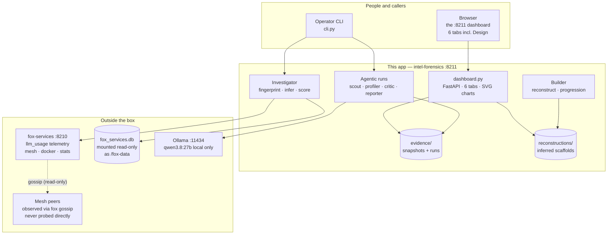
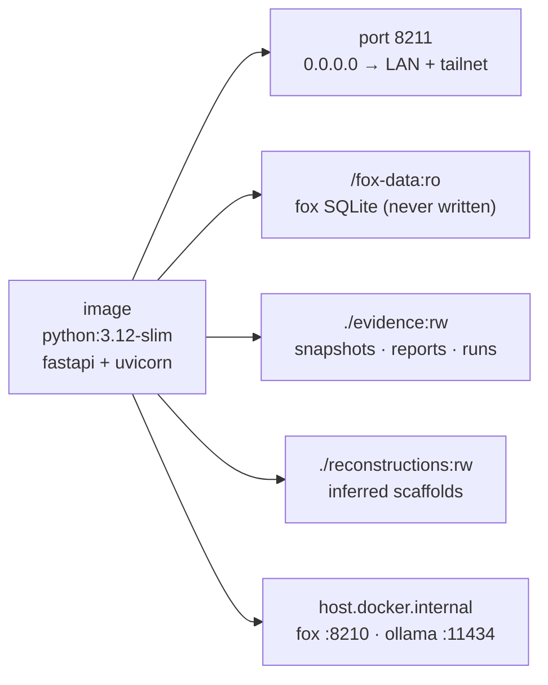

# 01 — System context

What is in the box, what is outside it, and what runs where.
`intel-forensics` is one container (port 8211) that watches the fox-services
telemetry stream and reconstructs what the other nodes on the mesh are
building — without ever seeing their repositories.

Related: [02-uml.md](02-uml.md) · [interaction.md](interaction.md) ·
[data-model.md](data-model.md) · [trust-boundaries.md](trust-boundaries.md)

## Context: the box and its neighbours

Every arrow is a real integration, and every arrow points *inward*: this app
only ever reads. It never writes to the fox DB, never calls a peer, never
touches a foreign repo. The single outbound inference path (agents → Ollama)
stays on localhost with a local-only model — see [privacy.md](privacy.md).

## Container: one image, four attachments

No Docker socket, no Tailscale socket, no secrets: the container cannot act on
the fleet even if compromised — it can only read telemetry and serve charts.
