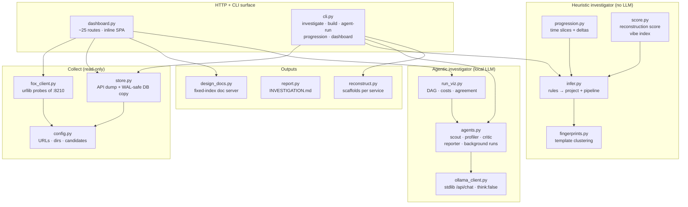
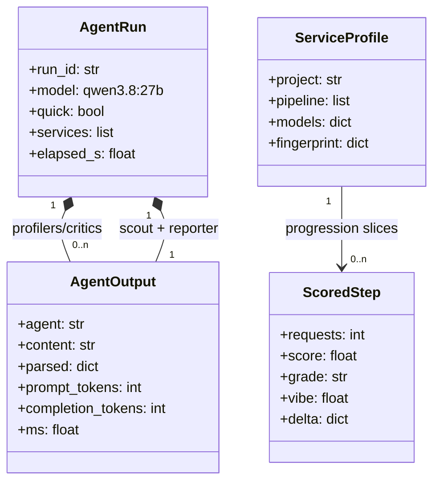

# 02 — UML structure

Which module owns which responsibility, and how they depend. One FastAPI app
(`dashboard.py`) plus a flat `iforensics/` package: every capability is a
module with a narrow job; `dashboard.py` and `cli.py` are the only wiring.

Related: [01-system-context.md](01-system-context.md) ·
[interaction.md](interaction.md) · [data-model.md](data-model.md)

## Components: who owns what

Dependency rule: heuristic modules never import the LLM client; the LLM client
never touches the database (agents receive rows, never a path); outputs never
import collectors. Information flows one way: collect → infer → present.

## Class sketch: the agent run

