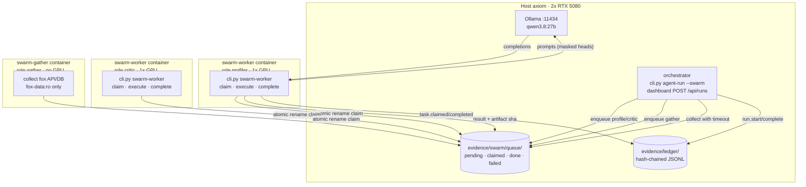
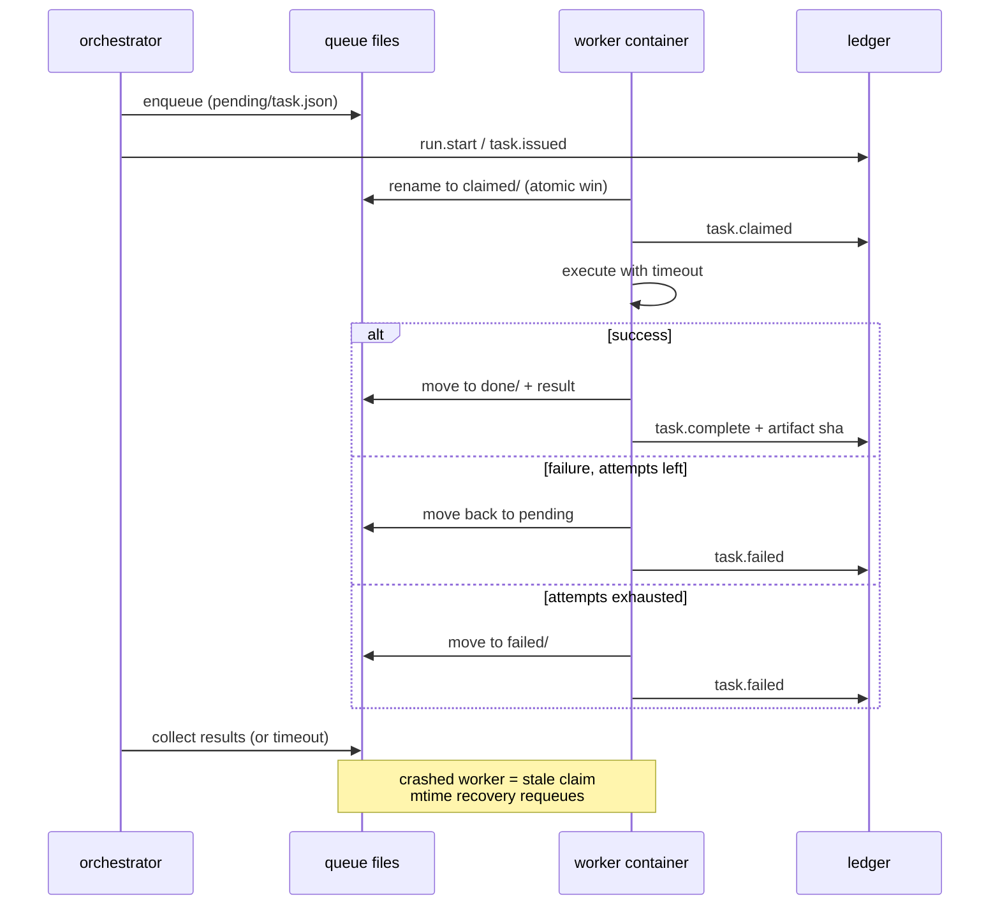
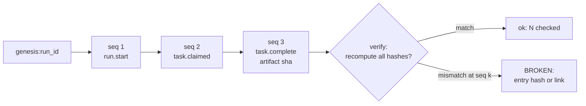
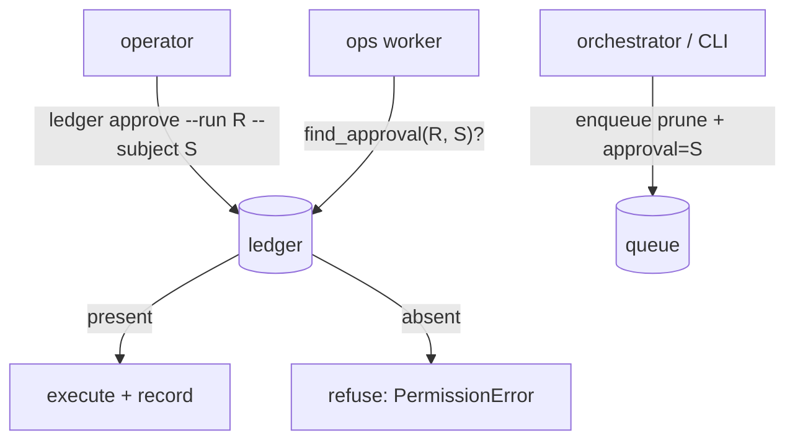

# 07 — Agent swarm

How forensic work is distributed across isolated container workers with
NVIDIA GPU passthrough, coordinated through a file task queue, and recorded
on a tamper-evident action ledger. Start here for P7.

Related: [trust-boundaries.md](trust-boundaries.md) (zones Z5–Z6, rules
T7–T8) · [interaction.md](interaction.md) · [data-model.md](data-model.md) ·
[01-system-context.md](01-system-context.md)

## Swarm topology: who runs where

Workers never talk to each other. The queue files are the only coordination
primitive (atomic `rename` elects exactly one claim winner); the ledger is
the only shared truth, and it is append-only.

## Task lifecycle: every state is a file move

A task whose worker dies mid-claim is not stuck: claims older than the
staleness window are moved back to pending with `attempts` bumped, so the
next live worker picks it up. After `MAX_ATTEMPTS` it parks in `failed/`
for a human.

## Ledger: tamper evidence without a blockchain

Each entry commits to the previous entry's hash (`prev_hash`) and carries
the SHA-256 of any artifact it produced. Editing, deleting, or reordering
an entry breaks verification at exactly that sequence number
(`cli.py ledger verify --run …`, `GET /api/swarm/verify`). The ledger holds
hashes and pointers only — prompt text stays in the referenced artifacts.

## Isolation: one container per role, least mount wins

| Role | GPU | Mounts | May touch |
|---|---|---|---|
| profiler / critic / security / any | 1 × GPU | `./evidence` only | collected evidence, queue, ledger |
| gather | none | `./evidence` + `/fox-data:ro` | fox telemetry (read-only), queue, ledger |
| orchestrator (host/CLI) | n/a | repo checkout | everything, incl. run manifests |

All worker containers run as the host UID (`user:` directive): root-owned
files on the shared `./evidence` volume once broke host-side ledger appends
(P7.35). Foreign prompt text is processed inside profiler containers and
fenced as untrusted data before reaching any model — see T8 and the D1
fencing in `ollama_client.py`.

## Destructive actions need a human

`prune` (and any future `export`) cannot run on a bare instruction:

`cli.py prune --apply` refuses without `--approve '<reason>'` and records
the approval on the `ops` ledger first. The worker re-checks the chain at
execution time, so a forged queue file alone cannot trigger deletion.
