# Reconstruction — stateless-inference residuals

What this experiment shows, how the surfaces are modelled, and what it does
**not** claim. A provider that advertises *stateless inference* promises no
chat history as a product feature — not zero residual data. Eight independent
surfaces still carry pieces of every request, and an insider who holds a
subset of them can pool those pieces across turns.

Related: [simulation.md](simulation.md) · [privacy.md](privacy.md) ·
[trust-boundaries.md](trust-boundaries.md) · [07-agent-swarm.md](07-agent-swarm.md)

## Where it runs

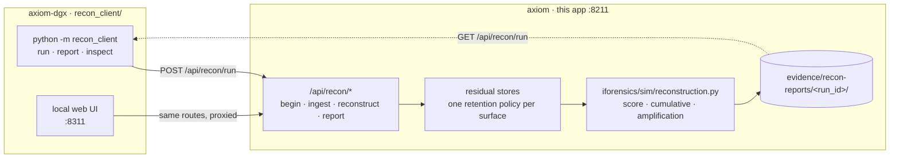

The client is transport and presentation only — **every number is computed
server-side**, because the log holder is the party being measured. The client
holds no scoring code, exactly like `sim/run.py` for P8.

## The eight surfaces

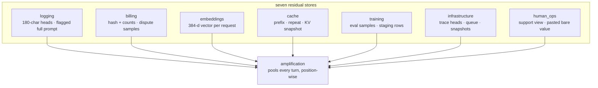

| surface | keeps | own accuracy (chat / coding / support) |
|---|---|---|
| `logging` | head always, full prompt at 15% | 0.61 / 0.83 / 0.70 |
| `billing` | hash always, full prompt at 9% | 0.33 / 0.68 / 0.60 |
| `embeddings` | vector only, **no text** | 0.0 / 0.0 / 0.0 |
| `cache` | prefix / repeat / newest KV | 0.89 / 0.83 / 0.95 |
| `training` | eval 14%, staging 8% | 0.79 / 0.77 / 1.00 |
| `infrastructure` | trace head always, queue 16%, snapshot 7% | 1.00 / 0.83 / 0.50 |
| `human_ops` | view 12%, **bare paste 5%** | 1.00 / 1.00 / 0.70 |

Rates are deterministic fractions of turns (`RATE` in
`reconstruction.py`) — a property of the store, not a random draw, so two
runs on two machines agree exactly. They are deliberately modest: a store
that kept *every* prompt would flatten the per-surface gradient, and the
gradient is the result.

The secret always sits at the **end** of a long carrier, so the 180-char
logging head and the 120-char trace payload truncate it away — the strongest
text stores are the ones that keep the *flagged* full prompt or the queue
message, not the ones that keep every head.

## What the query measures

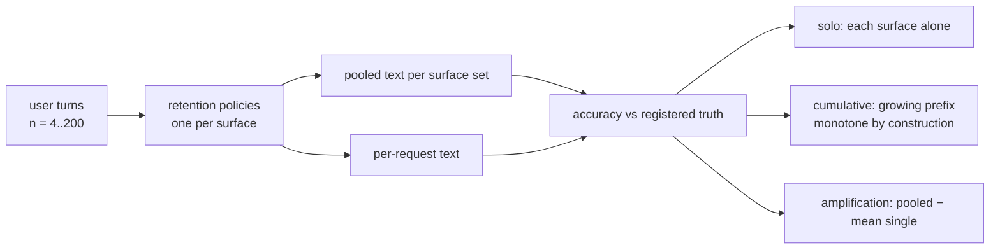

Three numbers per run:

1. **solo** — how much one store gives away in isolation (the gradient above).
2. **cumulative** — add surfaces in order; accuracy can only rise, because
   the text pool only ever grows. Marginal contribution is the delta.
3. **amplification** — mean accuracy judging *one* request against pooled
   accuracy over every request. Measured ≈0.21–0.25 single vs 1.0 pooled
   (Δ ≈ +0.75), i.e. repetition is the amplifier the threat model names.

## Honesty rules

- **Synthetic values only** — 900-series SSNs, `4242…` PANs, `example.com`,
  555 phones, from `iforensics/sim/sensitive.py`. Nothing real is ever sent.
- **No vector-only inversion is claimed.** `embeddings` stores vectors and
  reports `accuracy: 0` on its own. What it does report is *linkage*: the
  fraction of vectors that collapse into a few near-duplicate families
  (measured ≈0.98 of traffic across ≈4 families). Linkage is the *reason*
  fragments found in other stores can be lined up — it is an amplifier, not
  a decryption.
- **`amplification` is an analysis, not a store.** It reads the other seven
  and assembles position-wise; it holds no residual data of its own.
- **No live prompts are involved.** Sessions are generated server-side from
  scenario seeds, so a run is reproducible from `(scenario, seed, n)`.

## Limits

Single-process in-memory state: reset clears it and two workers would not
share it (the same constraint as P8's `SimState`). Sample rates are a
modelling assumption, not a measurement of any real provider. Real per-store
rates vary by vendor, retention window and whether a human ever looks — the
experiment shows *how much each surface can give away*, not how much any
particular vendor *does*.

## API surface

| route | does |
|---|---|
| `GET /api/recon/surfaces` | the eight surfaces, three scenarios, the rates |
| `POST /api/recon/begin` | register a user's ground truth |
| `POST /api/recon/ingest` | run one request through every retention policy |
| `POST /api/recon/reconstruct` | the insider's query over a chosen subset |
| `GET /api/recon/report` | solo · cumulative · amplification · curves |
| `POST /api/recon/run` | execute a scenario end-to-end, persist, return the report |
| `GET /api/recon/residuals` | raw view: what one store literally still holds |
| `GET /api/recon/runs` · `GET /api/recon/run` | persisted runs, newest file first |
| `POST /api/recon/reset` | clear every residual record and all truth |

## Per-surface retention
Each surface is a retention *policy* applied to every ingested turn,
not a hypothetical leak. The policy, in full:

### `logging` — Explicit logging & observability
_prompt heads for every request, full prompt when the safety or error sampler flags it, completion text; minutes–days while debugging; longer once flagged._

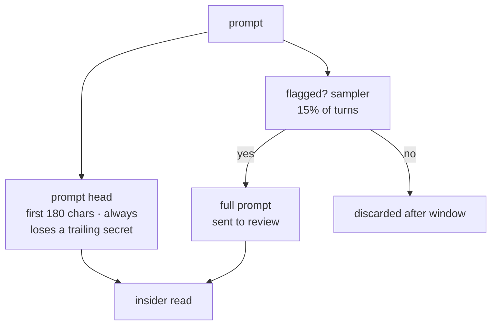

### `billing` — Token billing & usage metering
_input/output token counts, byte length, prompt SHA-256 for every request; the full prompt only when a dispute sample is taken; invoice lifetime — months, outlives the prompt policy._

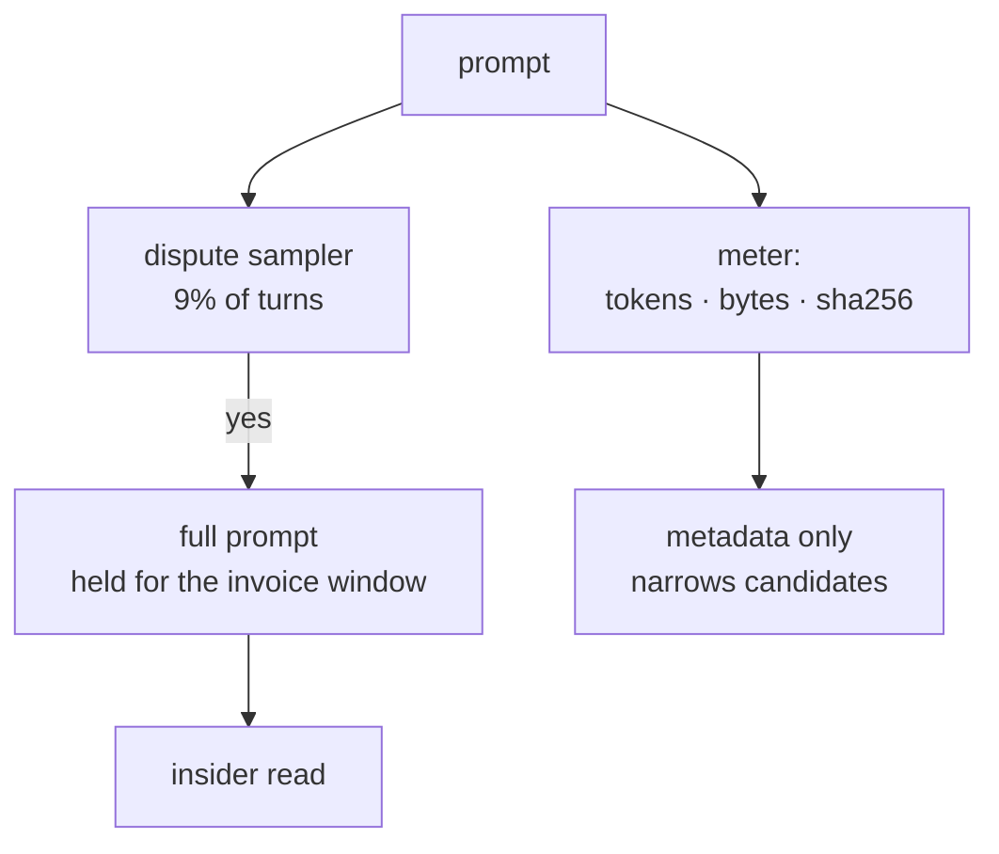

### `embeddings` — Vector embeddings & retrieval infrastructure
_a 384-d query vector per request (semantic cache, RAG, duplicate detection, analytics); as long as the index lives — often forever._

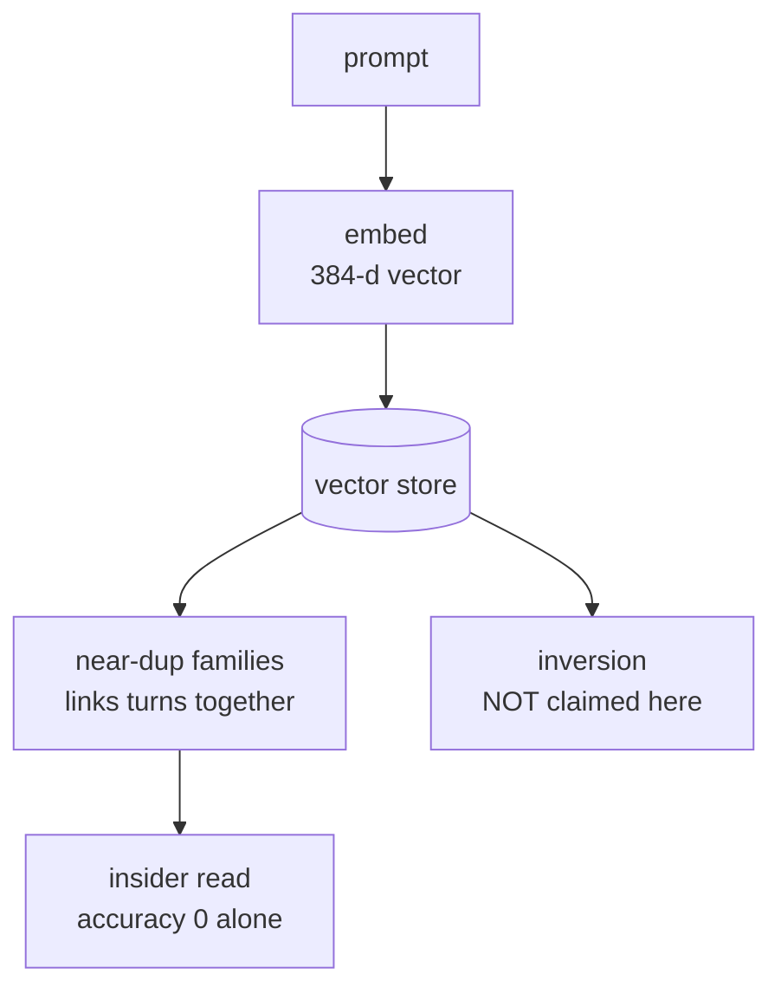

### `cache` — Caching layers
_exact prompt on a repeat hit, the shared prefix on a prefix hit, and the newest KV snapshot while it lingers in memory; seconds–hours of wall time, but a snapshot outlives it._

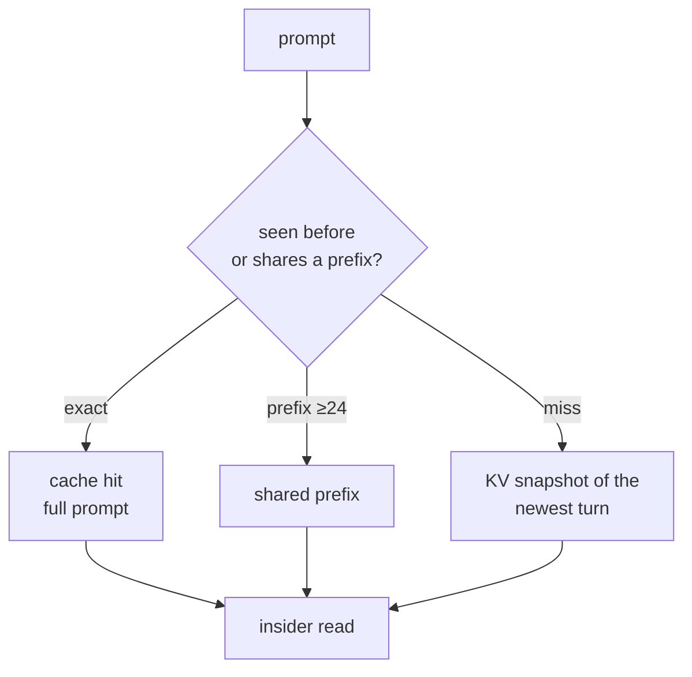

### `training` — Training & evaluation pipelines
_full prompts sampled for offline eval/red-teaming, plus rows still sitting in the staging table before the deletion job runs; days–30+ days (legal hold), even with opt-out._

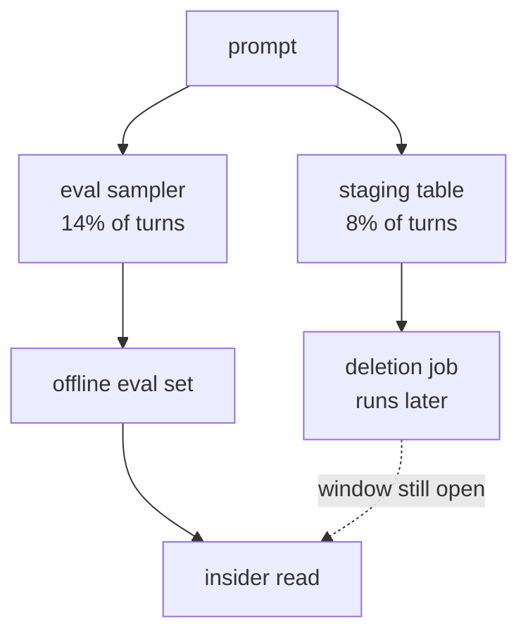

### `infrastructure` — Infrastructure & side residuals
_trace payload heads on every request, whole messages lingering in a queue, and object-storage snapshot versions; queue TTL + backup retention — both outlive the prompt._

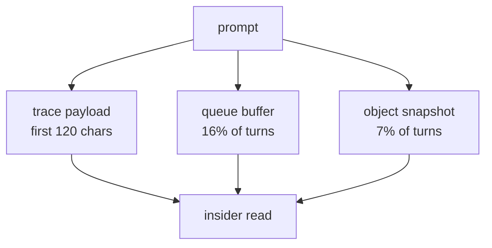

### `human_ops` — Human & operational access paths
_the window an employee views in a support tool, and — when someone pastes it into chat while debugging — the BARE value, not the mask; forever: chat history and ticket notes are never pruned by an inference-retention policy._

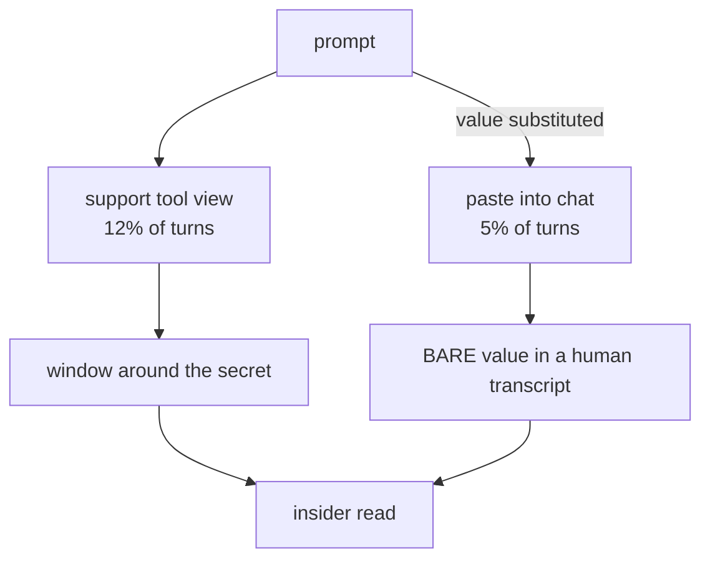

### `amplification` — Progressive / repeated near-query amplification
_nothing — it is the analysis that pools every selected surface across every turn and assembles fragments position-wise; n/a._

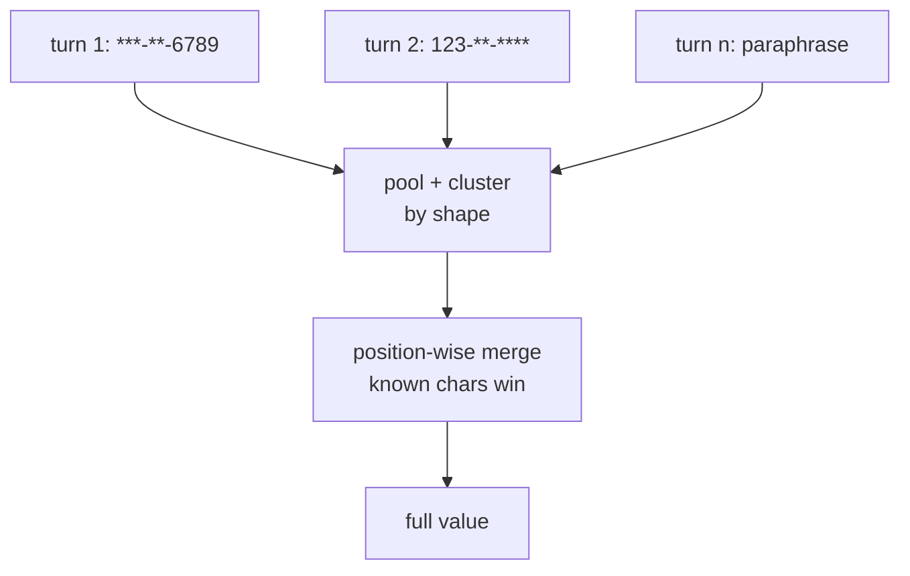
