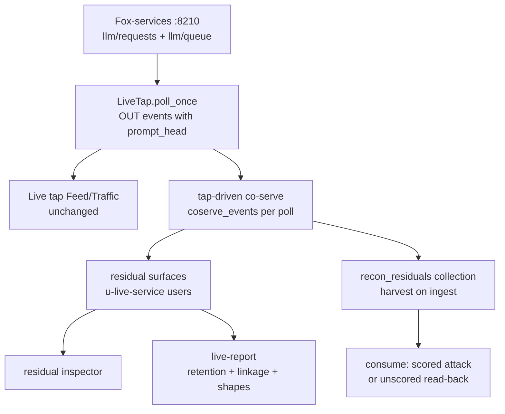
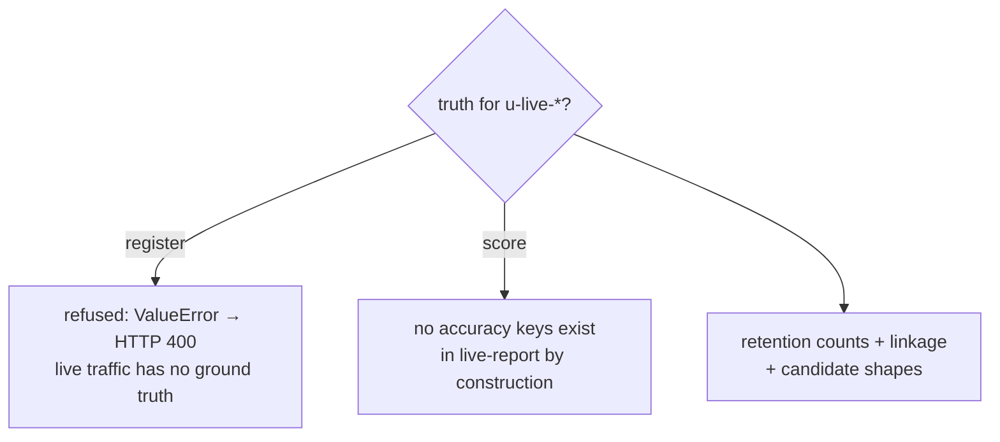
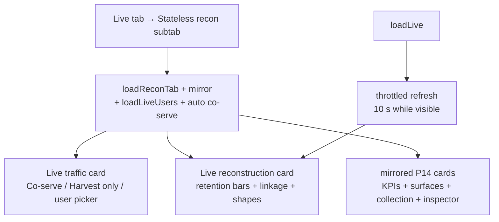

# Live reconstruction — tap-driven co-serving (P15–P17)

Static P14 sessions prove what residual surfaces keep. This document covers
the live half: while the tap sniffs Fox-services traffic, every poll
co-serves new completions into the same eight retention policies, so the
Stateless recon views stay warm with real service traffic — retention-only,
never scored.

## Data flow

`poll_once` collects the poll's fresh OUT events and calls `_maybe_coserve`
in a guarded block: reconstruction can never break the tap. Re-polls are
safe (tap-seq dedup); Reset clears records, collection rows, and seq memory
together. Manual `POST /api/recon/coserve` does the same on demand; `POST
/api/recon/coserve-auto` flips the per-poll flag (on by default at tap
start, reported in `/api/live/status`).

## Ethics gate: live users are never scored

- `register_truth` refuses `u-live-*` (engine `ValueError` → HTTP 400 on
  `/api/recon/begin`).
- `live_report` carries retention per surface, embedding linkage, and
  unscored candidate shapes — a key-walk test asserts no `accuracy` keys.
- `consume` with `attack:true` on a live user 404s with a message that
  points at `attack:false` read-back (never at `begin`, which would 400).
  The UI falls back automatically and renders a "read-back, unscored"
  verdict pointing at the inspector.

## UI wiring

The subtab mirrors the dedicated Stateless recon tab (`mirrorReconToLive`,
`l`-prefixed ids): one engine, two views, zero duplicated renderers.

## Framework mapping

`iforensics/sim/recon/live.py` (`enable` / `disable` / `status` /
`report` / `users`) is the framework layer over this wiring; build
instructions live in `to-do-insider-recon-instructions.md`. Mitigations
(`recon/mitigations.py`) apply to co-served rows exactly as to simulated
ones — DLP redaction and retention caps flatten live retention the same way.
