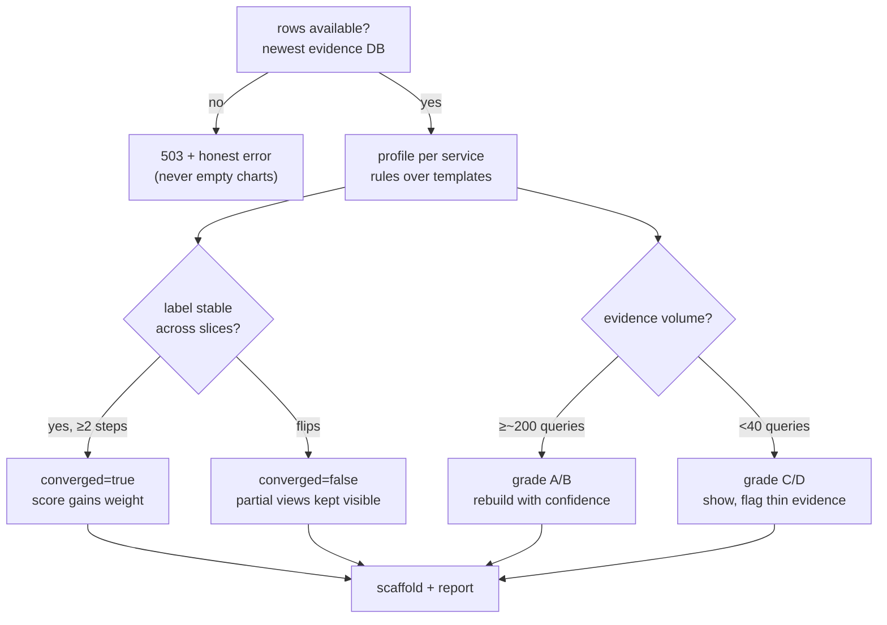
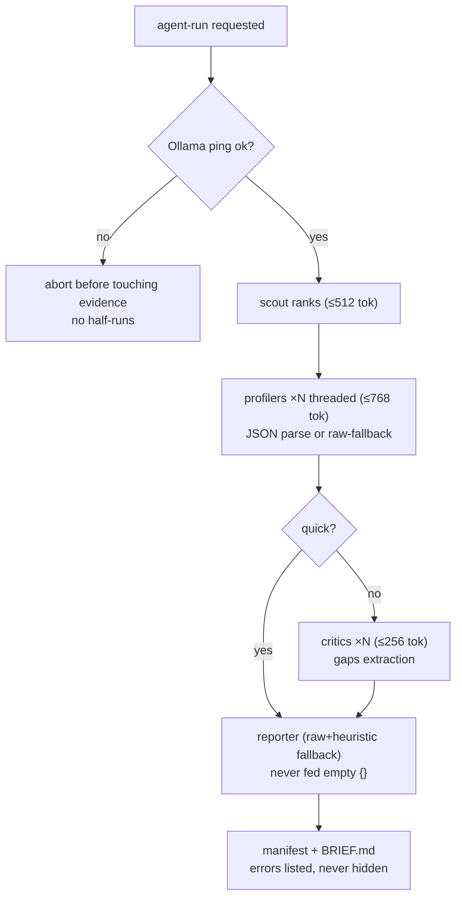
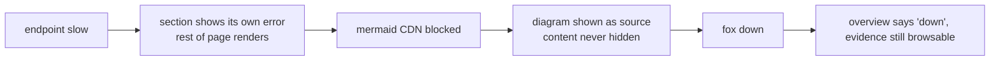

# 04 — Activity

The decisions the pipeline makes: which rows count, when a label sticks, when
a run is trustworthy, and when the UI degrades instead of failing.

Related: [interaction.md](interaction.md) · [02-uml.md](02-uml.md)

## Investigation lifecycle: from queries to verdict

## Agent-run decisions

Two rules learned the hard way and now encoded: token budgets floor at the
size the JSON actually needs (truncated JSON parses to nothing), and the
reporter is never fed empty parses — it falls back to raw output plus the
heuristic label, so a cascade failure becomes a weaker brief, not fiction.

## UI degradation ladder

