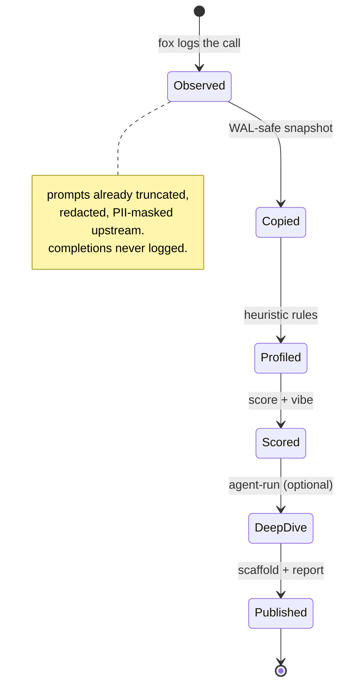

# 05 — Data model

What is stored, how it relates, and how records move through states. Three
stores: the fox telemetry we read, the evidence we keep, and the
reconstructions we publish. We own only the last two.

Related: [privacy.md](privacy.md) · [interaction.md](interaction.md)

## ER: the three stores

```mermaid
erDiagram
    FOX_LLM_USAGE ||--o{ EVIDENCE_DB : "copied read-only";
    FOX_LLM_USAGE {
        int id PK
        float ts
        string service
        string model
        int prompt_tokens
        int completion_tokens
        string prompt_masked_head
        string query_type
        string requestor
    }
    EVIDENCE_DB {
        string file
        string stamp
    }
    EVIDENCE_DB ||--|| INVESTIGATION : "profiles all rows";
    INVESTIGATION {
        string service PK
        string project
        string pipeline
        float score
        float vibe
    }
    INVESTIGATION ||--o{ PROGRESSION_STEP : "slices";
    PROGRESSION_STEP {
        int step
        int requests
        float score
        string grade
        json delta
        bool converged
    }
    INVESTIGATION ||--o{ AGENT_RUN : "deep dives";
    AGENT_RUN {
        string run_id PK
        string model
        bool quick
        float elapsed_s
    }
    AGENT_RUN ||--o{ AGENT_OUTPUT : "scout/profiler/critic/reporter";
    AGENT_OUTPUT {
        string agent
        string service
        string content
        json parsed
        int tokens
    }
    INVESTIGATION ||--o{ SCAFFOLD : "one per service";
    SCAFFOLD {
        string service PK
        string inferred_pipeline_py
        string prompts_templates
        json RECONSTRUCTED_json
    }
```

## Record lifecycle



Nothing ever moves backwards: raw rows are never re-enriched, masked values
are never "unmasked", and scaffolds never claim to be source — see
[ethics.md](ethics.md).
