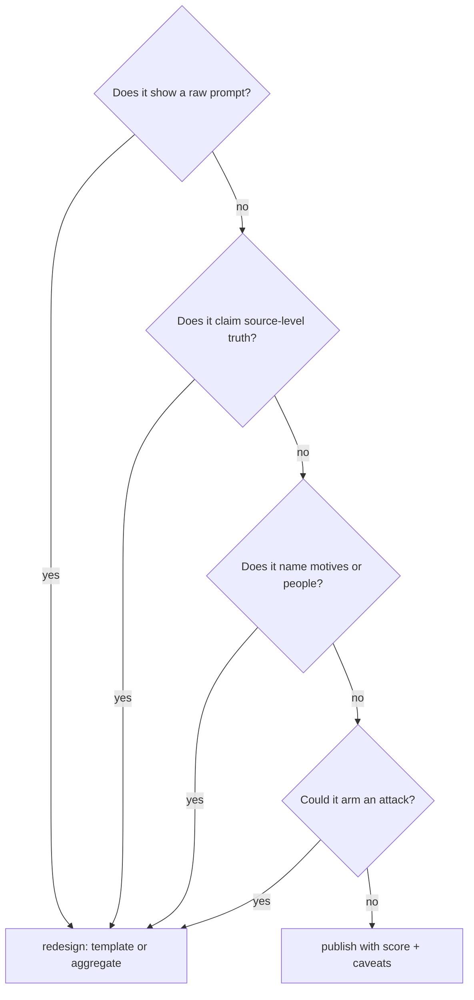

# 08 — Ethics

The constraints that keep forensic reconstruction honest. Capability without
these is surveillance with charts; with these, it is engineering archaeology.

Related: [trust-boundaries.md](trust-boundaries.md) · [privacy.md](privacy.md)

## Constraints (binding on features and on write-ups)

| # | Constraint | What it forbids | How it is kept |
|---|------------|-----------------|----------------|
| E1 | Inference ≠ source | Presenting a scaffold as the service's actual code | Every reconstruction ships `RECONSTRUCTED.json` + caveats; docs say "templates + pipeline, not exact source" |
| E2 | Uncertainty is quantified | Single-label verdicts from thin evidence | Scores, grades, confidence, `converged` flags, and flip badges travel with every claim; D-grade outputs are shown *as* D-grade |
| E3 | No attribution of intent | "They built X to do harm" from prompt shapes | Profiles describe *mechanisms* (extracts facts, scores risk), never motives; the reporter brief is about posture, not blame |
| E4 | Vibe labels stay technical | Using "pure vibe" as ridicule | The vibe index is defined mechanically (reuse × focus × simplicity) and documented as architecture description, not quality judgement |
| E5 | Consentful observation | Probing peers or exfiltrating to observe more | T2: observation is limited to locally consented telemetry (own fox node) plus mesh gossip the mesh already shares |
| E6 | No weaponization | Turning reconstructions into attack material (prompt-injection surfaces, key extraction) | Critic gaps frame *observation* needs, never exploit steps; findings stay at pipeline granularity, never credential/secret granularity |
| E7 | Right to correction | A wrong profile standing forever | Evidence is timestamped snapshots; re-running `investigate` supersedes; reports carry run IDs, not timeless verdicts |

## Decision check (run before publishing any new view)

The current UI passes: quotes are ≤160-char masked template lines, claims
carry scores, authors are services not humans, and nothing published is
finer-grained than pipeline stages.
