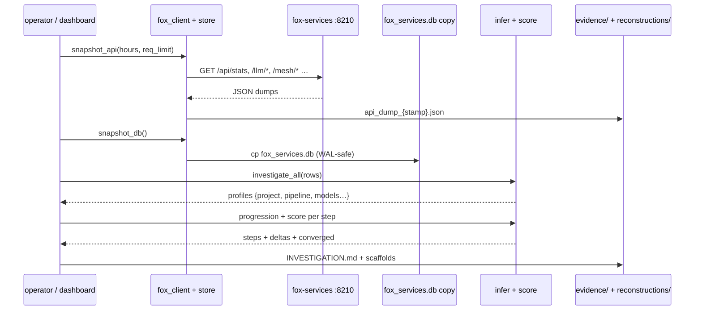
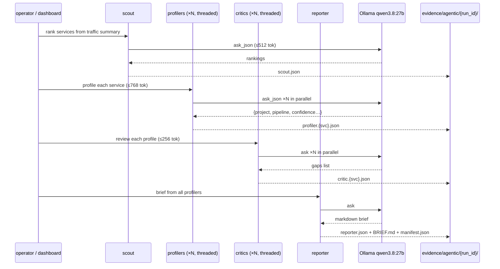
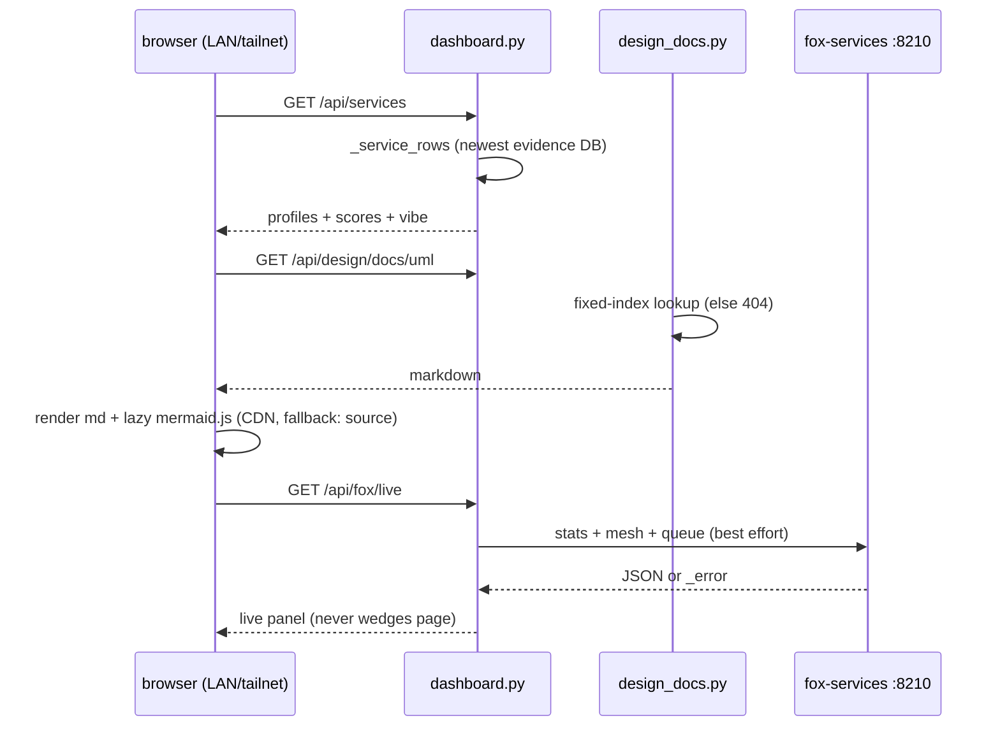

# 03 — Interaction

What calls what, in what order, on every major flow. Three flows matter:
heuristic investigation, agentic run, and serving. All reads; the only write
targets are our own `evidence/` and `reconstructions/` directories.

Related: [02-uml.md](02-uml.md) · [activity.md](activity.md) ·
[data-model.md](data-model.md)

## Flow 1: heuristic investigation (`investigate` + `build`)

## Flow 2: agentic run (`agent-run`, full mode)

Quick mode skips the critic stage and profiles only the top-3 services.
Dashboard launches run the same function on a background thread and poll
`background_status` — the HTTP request never blocks on the model.

## Flow 3: serving (dashboard + Design tab)

