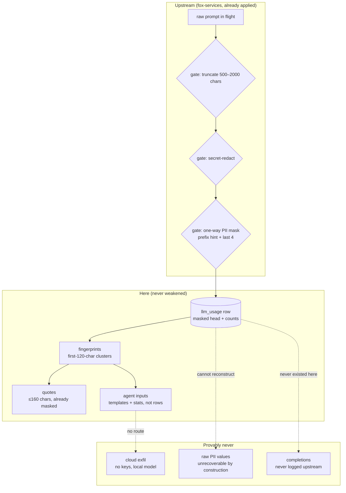

# 07 — Privacy

What data exists, where it can go, and what provably cannot leave. This app
investigates other people's prompts, so it inherits fox-services' guarantees
and adds one of its own: findings are published as *patterns*, never transcripts.

Related: [trust-boundaries.md](trust-boundaries.md) ·
[data-model.md](data-model.md) · [ethics.md](ethics.md)

## Data flow with privacy gates

## Measures (what we do, concretely)

| # | Measure | Where |
|---|---------|-------|
| P1 | Work only from masked heads | `store.load_requests` selects the `prompt` column as-is; no unmask path exists anywhere |
| P2 | Agents see templates, not transcripts | `_compact_profile` sends cluster templates + counts (≤280 chars each), never full rows |
| P3 | Published quotes are short and masked | UI caps quotes at 160 chars; source values were masked upstream before we ever read them |
| P4 | Only aggregates persist as findings | Scores, counts, pipeline names — the report contains no per-request payload |
| P5 | Evidence stays on local disks | Bind mounts (`./evidence`, `./reconstructions`); no upload, no telemetry, no phone-home |
| P6 | Local-only inference | Agent prompts go to `qwen3.8:27b` on localhost; a cloud model would require deliberate reconfiguration, which the trust table forbids (T3) |

## Residual risks (admitted, not hidden)

- A masked head can still carry sensitive *topics* (e.g. "diagnosis prompt about X").
  Mitigation: findings quote templates, and the ethics doc restricts what may be
  published about whom (E3, E4).
- The dashboard has no auth. Mitigation: deployment-scoped exposure (LAN/tailnet
  only) + no raw rows in any served payload — the API serves profiles, never
  `SELECT *`.
