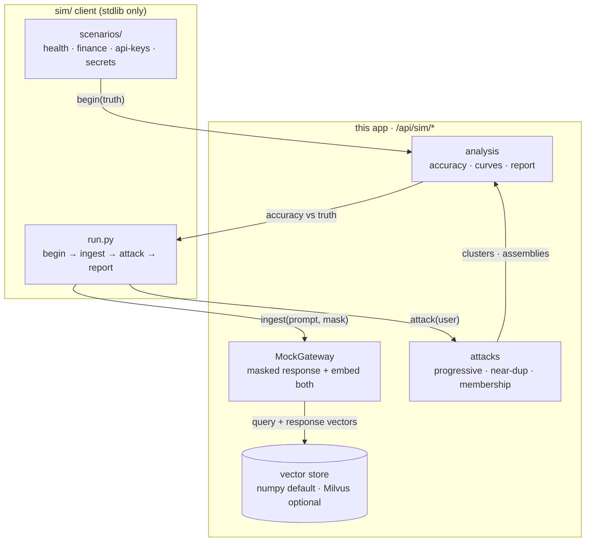
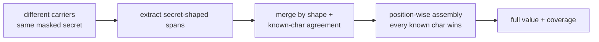

# Simulation — embedding reconstruction attacks

What this experiment shows, how it is built, and what to conclude. The
simulation demonstrates that **repeated similar queries leak sensitive
values when a gateway logs query/response embeddings**: masked variants
cluster by cosine similarity, and position-wise assembly of the unmasked
characters recovers the full secret.

Related: [privacy.md](privacy.md) · [trust-boundaries.md](trust-boundaries.md) ·
[01-system-context.md](01-system-context.md)

## Experiment loop



The client knows the secrets; the server only ever sees masked texts and
embeddings. The attack runs server-side on vectors + texts alone — the same
information a real log holder has.

## Disclosure mechanics: two complementary paths

Carrier clustering (cosine over full texts) groups near-identical
repetitions; it fragments as soon as carriers are paraphrased (measured
0.08–0.16 across rewordings — near-unrelated). The robust path is
structural:



Masks of one value share a shape (`###-##-####` covers `***-**-6789`,
`123-**-****` and the bare secret); conflicting values split into separate
groups even at identical shape. Membership probes compare the candidate
against extracted spans, not whole sentences, so carrier wording drops out
(logged secrets ~0.56–0.75, unseen ~0.0).

Each query alone reveals little; together they reveal everything. The
progression curve (accuracy vs number of queries) is the chart that matters:
it is monotone non-decreasing by construction, and its slope measures how
fast repetition burns a secret.

## What the results mean

- **Complete-disclosure regimes recover at 1.0 through paraphrase and
  distractor noise** (health, finance, api-keys): the structural path is
  unaffected by carrier rewording that defeats pure cosine clustering.
- **Partial regimes plateau below 1.0** (`coding_secrets`, final slot never
  disclosed: 0.93/0.97) — the curve levels off instead of completing, which
  is the measurable payoff of never logging the full value.
- **Coding styles compared** (`coding_api_keys --style …`, live): one-off
  (3 turns, direct read), regular (progressive assembly over paraphrase),
  vibe (immediate — full secret pasted in turn 1). All reach 1.0, and every
  field carries `direct_exposure: true`: whenever the bare value hits the
  log even once, no assembly is needed — anyone with read access just reads
  it. The attack machinery only matters for *partial* disclosures.
- **Membership inference** separates logged secrets (~0.56–0.75, higher when
  stored verbatim) from unseen values (~0.0) with wide margin.
- **Plausibility** (`/api/sim/report` → `plausibility`): each chain step
  graded high/medium/low. Bottom line: the chain is plausible end-to-end
  for any operator who already logs prompts beside embeddings — the only
  exotic step is obtaining read access. Pure vector-only inversion remains
  the hard case this demo does NOT claim.
- **Mitigations this setup can test**: per-user retention limits (fewer stored
  pairs = flatter curve), never logging the full value (partial regime —
  measured plateau), active DLP (`off|audit|redact|block`, measured: redact
  drops 6/8 fields to 2/8 recovered, with short-numeric-PII coverage gaps),
  and embedding encryption at rest.
- **Reconstruction runs on the agent swarm too**: `sim_reconstruct` worker
  kind + `POST /api/sim/attack {"swarm": true}` dispatches per-user
  structure attacks to GPU containers with ledger entries; the estimator
  (`exposure` score, no ground truth) predicts leakage from structure alone.

## Running it

```bash
uv venv sim/.venv                                  # once; stdlib only, no deps
sim/.venv/bin/python sim/run.py --all              # all four scenarios
sim/.venv/bin/python sim/run.py --scenario coding_api_keys --style vibe
sim/.venv/bin/python sim/run.py --all --dlp-mode redact   # mitigation sweep
```

The dashboard must be up (`docker compose up -d`): the client drives
`/api/sim/*`, and the Sim tab shows curves, reconstructions, estimates,
DLP state and plausibility for whatever was ingested.

## Honest limits

- The mock gateway *echoes* the masked secret; a real LLM paraphrases, which
  spreads the signal across more varied surface text (harder assembly, same
  clustering principle).
- Hash embeddings are order-insensitive bags; transformer embeddings separate
  paraphrases better and exact strings worse. Both backends are supported;
  conclusions should be re-checked per backend.
- Milvus is optional infrastructure here, not load-bearing: the numpy store
  implements the same API, and `connect()` degrades with a note.
