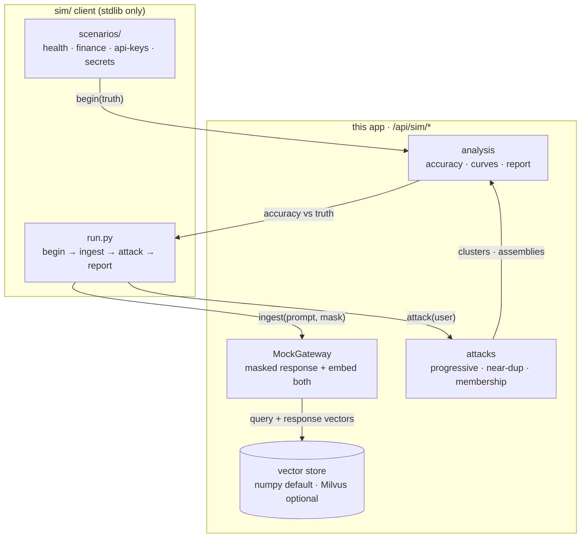
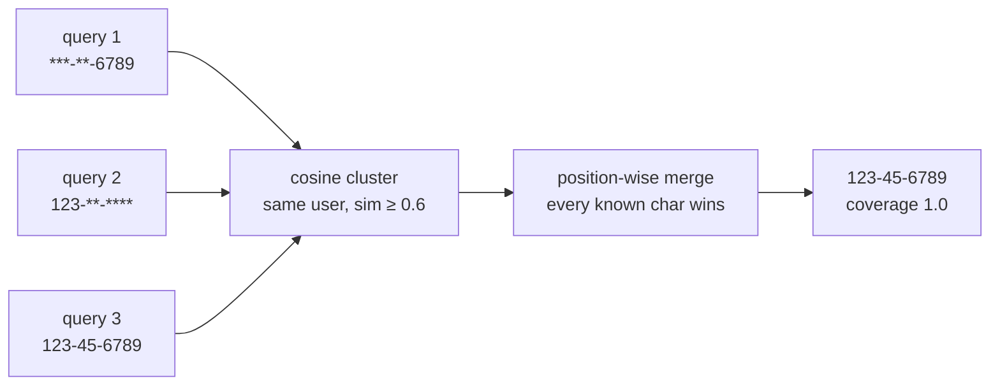

# Simulation — embedding reconstruction attacks

What this experiment shows, how it is built, and what to conclude. The
simulation demonstrates that **repeated similar queries leak sensitive
values when a gateway logs query/response embeddings**: masked variants
cluster by cosine similarity, and position-wise assembly of the unmasked
characters recovers the full secret.

Related: [privacy.md](privacy.md) · [trust-boundaries.md](trust-boundaries.md) ·
[01-system-context.md](01-system-context.md)

## Experiment loop

The client knows the secrets; the server only ever sees masked texts and
embeddings. The attack runs server-side on vectors + texts alone — the same
information a real log holder has.

## Disclosure mechanics

Each query alone reveals little; together they reveal everything. The
progression curve (accuracy vs number of queries) is the chart that matters:
it is monotone non-decreasing by construction, and its slope measures how
fast repetition burns a secret.

## What the results mean

- **8/8 fields recovered at 1.0** across all four scenarios is expected, not
  surprising: the final step of every schedule discloses the full value.
  The finding is the *curve*, not the endpoint — accuracy climbs steeply
  within 2–3 repetitions.
- **Membership inference** separates logged secrets (~0.56–0.74) from unseen
  values (~0.0–0.05) with wide margin on the hash backend.
- **Mitigations this setup can test**: per-user retention limits (fewer stored
  pairs = flatter curve), mask normalization before embedding (destroys the
  positional signal), query dedup (collapses the cluster), and embedding
  encryption at rest (raises the bar from read to break).

## Honest limits

- The mock gateway *echoes* the masked secret; a real LLM paraphrases, which
  spreads the signal across more varied surface text (harder assembly, same
  clustering principle).
- Hash embeddings are order-insensitive bags; transformer embeddings separate
  paraphrases better and exact strings worse. Both backends are supported;
  conclusions should be re-checked per backend.
- Milvus is optional infrastructure here, not load-bearing: the numpy store
  implements the same API, and `connect()` degrades with a note.
