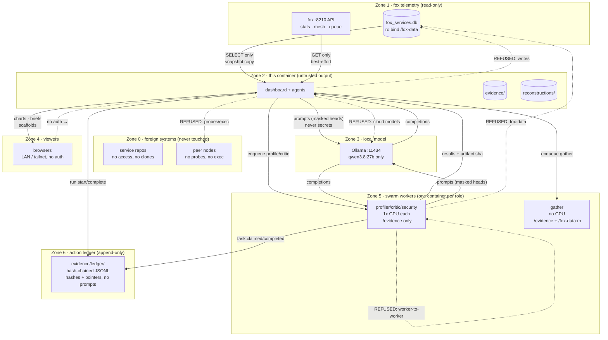

# 06 — Trust boundaries

What crosses each boundary, in which direction, and what is refused. The
design rule is simple: telemetry flows in, nothing that can act flows out.

Related: [privacy.md](privacy.md) · [ethics.md](ethics.md) ·
[01-system-context.md](01-system-context.md) ·
[07-agent-swarm.md](07-agent-swarm.md)

## Boundaries and crossings

## Boundary rules (enforced, not advised)

| # | Rule | Enforcement |
|---|------|-------------|
| T1 | Fox DB is never written | `:ro` bind mount; SQLite opened read paths only |
| T2 | No peer contact | No peer IPs/URLs in code; mesh data arrives only via fox gossip reads |
| T3 | Inference is local-only | `IF_MODEL` defaults to `qwen3.8:27b`; `OLLAMA_URL` defaults to loopback/host-internal; no API keys exist to leak |
| T4 | No secrets to hold | Container has no tokens, no keys, no Docker socket — theft yields telemetry summaries, not access |
| T5 | Viewer boundary is explicit | No auth is implemented, so exposure is LAN/tailnet only by deployment (bind + firewall), documented in README, never assumed |
| T6 | Reconstructions are labeled | Every scaffold ships `RECONSTRUCTED.json` + caveats; the UI never presents inference as source |
| T7 | Workers are isolated, least mount wins | One container per swarm role with NVIDIA passthrough; workers run as host UID (`user:`); profilers mount `./evidence` only, only gatherers get `/fox-data:ro`; no worker-to-worker traffic |
| T8 | Destruction needs a recorded human | `prune --apply` refuses without `--approve` (logged to the `ops` ledger); worker `prune` tasks re-check `find_approval` at execution time; the ledger itself is append-only and hash-verified |
