# Simulation scenarios — what each experiment leaks, and how

Two scenario families drive every number in the dashboard. Both use
**synthetic values only** (900-series SSNs, `4242…` PANs, `example.com`,
555 phones, `sk-test-` tokens) and both are bit-reproducible for a fixed
`(scenario, seed, n_turns)`.

- **Embedding-reconstruction sim** (`sim/scenarios/`, 10 workloads) —
  progressive masked disclosure → cosine clustering → position-wise
  assembly. Answers: *how much of a secret leaks through repeated,
  increasingly explicit requests?*
- **Stateless-residual sim** (`iforensics/sim/reconstruction.py`, 3
  workloads) — every turn through eight retention policies (logging,
  billing, vectors, caches, training, infrastructure, support tooling)
  plus the repeat-query amplifier. Answers: *what does a "stateless"
  provider still retain, per surface and pooled?*

The framework mirrors all thirteen under `iforensics/sim/recon/scenarios/`
(3 engine-mapped + 6 generic-builder + live co-serving).

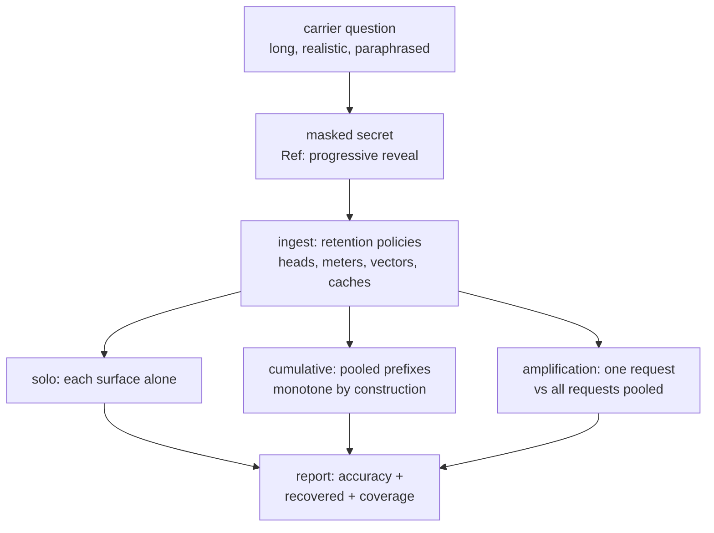

Disclosure mechanics shared by every scenario: the secret sits at the **end**
of a long carrier (so 180-char heads and 120-char traces genuinely lose it);
masks reveal in thirds/steps; later turns paraphrase the carrier (cosine
clustering stays weak while structural assembly stays strong); every sixth
turn interleaves a secret-free distractor; users periodically re-send a
previous message verbatim (exact-match cache hits).

## Embedding-reconstruction scenarios (`sim/`)

### chatbot_health — patient checkups (`u-health`: ssn, bp)

Repeated health-trend questions with progressive PII disclosure. Short,
highly structured values (SSN `###-##-####`, BP `###/##`) assemble fast —
the baseline every other scenario is compared against.

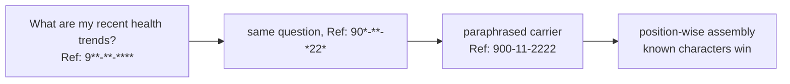

### chatbot_financial — disputes (`u-finance`: account_number, credit_card)

Balance and card-link questions. PANs (`4242 #### #### ####`) survive in
dispute-sampled full prompts; account numbers (`####-####-####`) fragment
across meters and traces — partial regimes plateau below 1.0 by design.

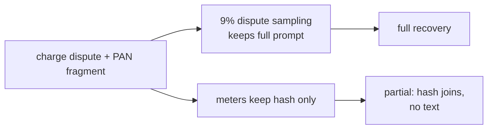

### coding_api_keys — integration help (`u-code`: api_key, aws_key)

`sk-test-…` (24 chars) and `AKIA…` (20 chars) pasted into debugging
threads. Long random alphabets defeat prefix caches but survive anywhere
full text is kept — the avalanche case for never-log-full mitigations.

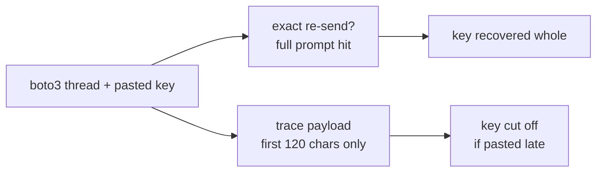

### coding_secrets — broken connections (`u-secrets`: db_password, api_key)

Passwords have no internal structure (16 mixed chars), so assembly gets no
shape help — recovery is all-or-nothing per store. Shows why shape grouping
matters: secrets *with* shapes leak gradually, shapeless ones leak wholesale.

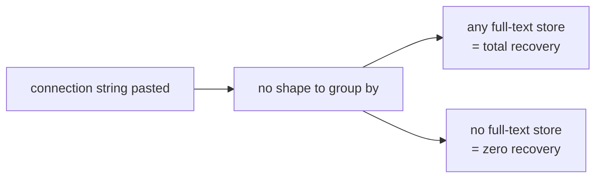

### hr_onboarding — new hires (`u-hr`: person_name, home_address, salary, bank_account)

Four-field breadth test. Names/addresses assemble from windows; salary and
bank routing fragment. Measures the framework across heterogeneous shapes
in one session.

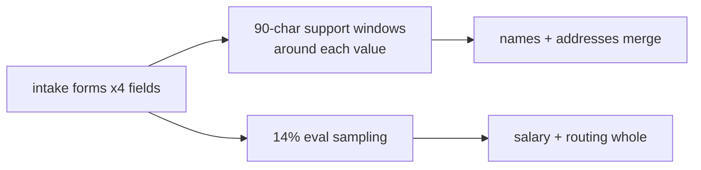

### support_tickets — triage (`u-support`: email, phone, order_id)

Short identifiers customers paste into tickets. High-exposure surface mix
(support views, snapshots) — the "everything is logged" regime where even
cumulative prefixes saturate early.

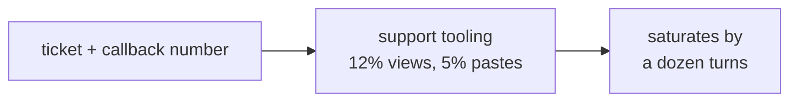

### devops_deploy — failing pipelines (`u-devops`: deploy_token, ssh_key, slack_webhook)

Credential-dense threads (tokens, keys, webhook URLs). Webhook URLs carry
structure (`hooks.example.invalid/...`) that assembles across truncated
copies — the staged `tool_use` surface's motivating case.

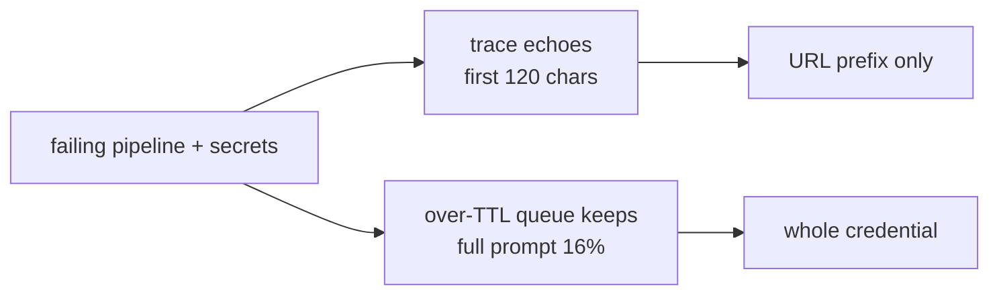

### legal_contracts — redlines (`u-legal`: deal_value, company, person_name)

Low-structure values (names, amounts) in long clause carriers. Secrets sit
deep inside prose, so head-only stores see almost nothing — the gradient's
low end, where only full-text samplers recover.

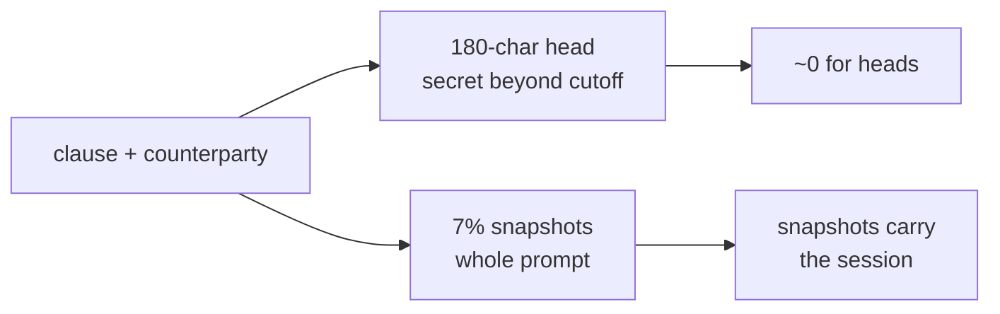

### sales_crm — enrichment (`u-sales`: email, phone, deal_value)

Rep-pasted contact PII in short notes. Short carriers mean heads capture
more — inverts the legal_contracts profile and proves carrier length, not
just policy, sets the ceiling.


### data_engineering — broken ETL (`u-data`: db_conn_string, account_number)

Connection strings mix structure (scheme, host) with randomness (password).
Structured halves assemble; random halves need a full-text store — the
cleanest demo of *partial* recovery as a designed outcome.

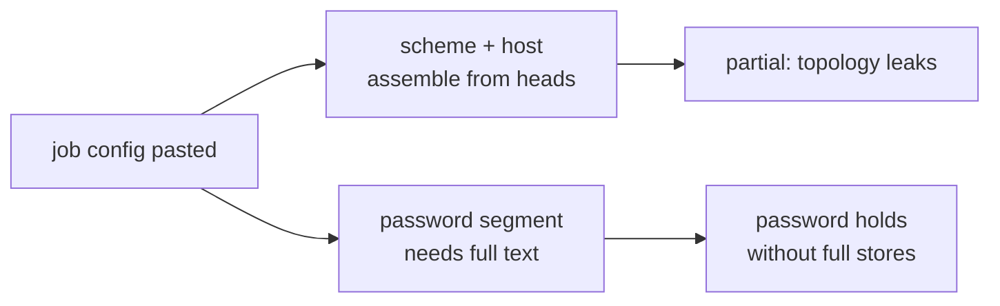

## Stateless-residual scenarios (P14 engine)

Same disclosure contract, six reveal steps, three workloads. Each runs
through all eight surfaces; reports add solo / cumulative / amplification.

### stateless_chat — health chat (`u-recon-chat`: ssn, bp)

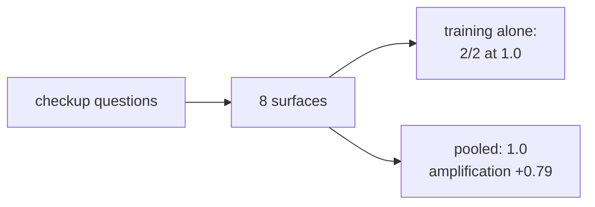

### stateless_coding — coding sessions (`u-recon-coding`: api_key, db_password)

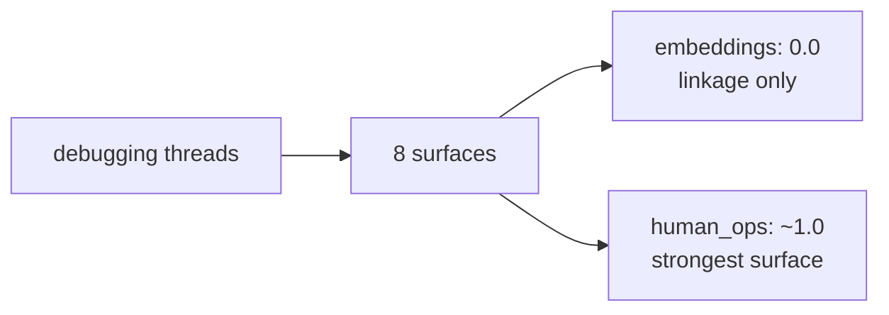

### stateless_support — support desk (`u-recon-support`: email, phone)


## Reproduce any scenario

```bash
# embedding sim (full client)
/home/fox/codebase/.venv/bin/python sim/run.py --all
# stateless residual (server-side, persisted + ledgered)
/home/fox/codebase/.venv/bin/python -m iforensics.sim.recon.client.run \
  --server http://localhost:8211 run --scenario stateless_coding --n 48 --seed 42
```

Identical `(scenario, seed, n)` ⇒ identical numbers on any machine.
Complete disclosure reaches 1.0; partial regimes plateau below 1.0 —
both by design, both tested (`iforensics/sim/recon/tests/`).
